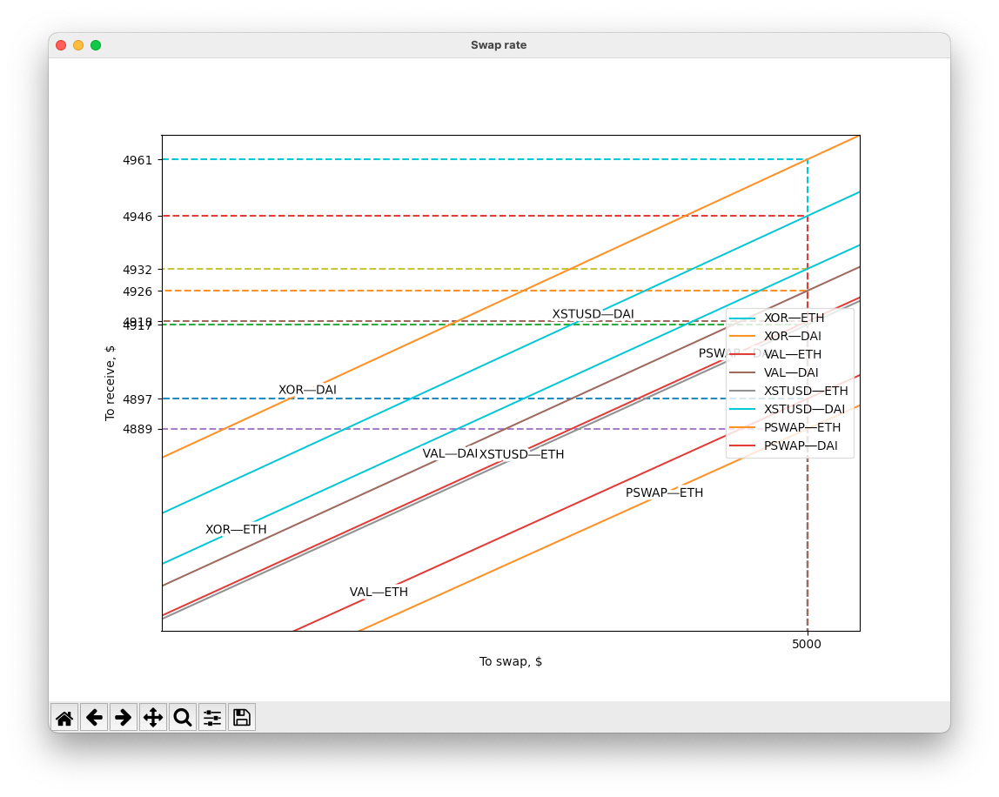

# Polkaswap swap rate plotter

Run this *Python* script to get a chart of current swap rates at [Polkaswap](https://polkaswap.io)

## Usage

### Basic

1. Run with the following

   ```bash
   python3 src/main.py
   ```

1. Zoom in the most interesting amount

### CLI arguments

`--stable-xstusd` — treat the price of *XSTUSD* equal to **1$**

### Changing parameters

You can easily change some parameters for your use-case. Edit the next variables in [main.py](src/main.py):

1. `ASSET_ADDRESSES` – to add/remove assets
2. `SWAP_PAIRS` – to add/remove swap pair to be plotted
3. `X_VALUES` – to add/remove amount in dollars on the X axis

## Demo


